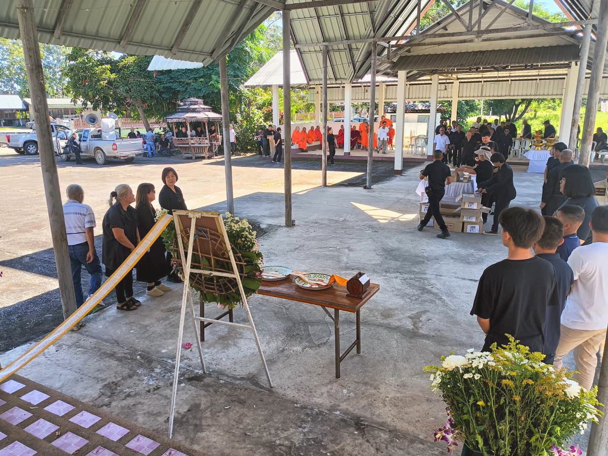
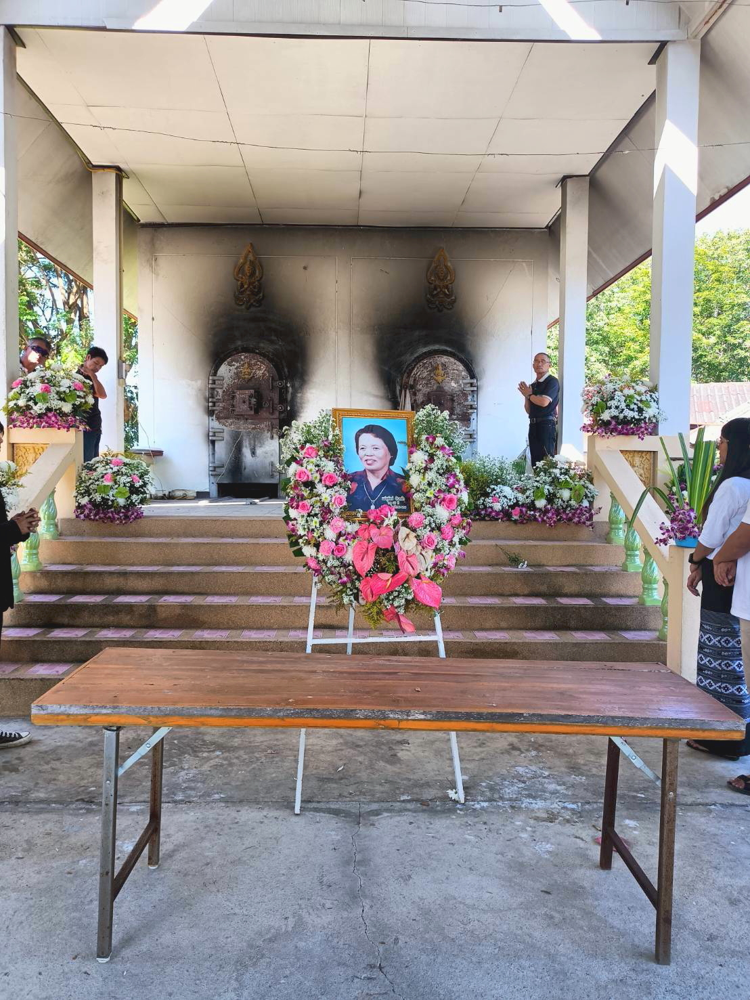
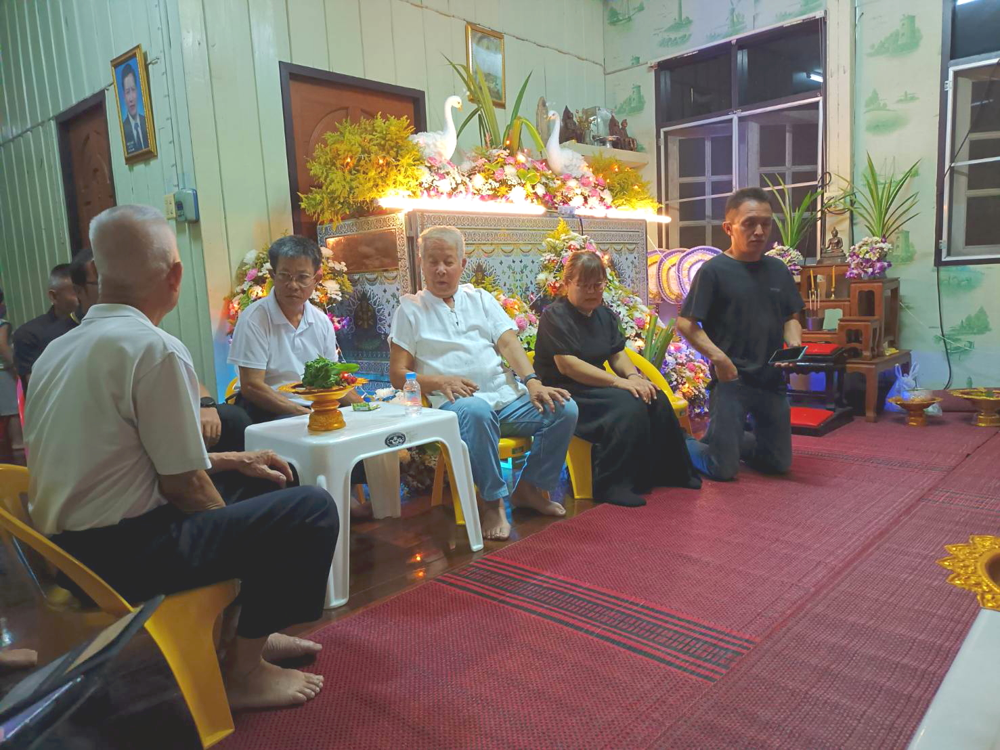

<html>
<head>

<meta charset="UTF-8">
<meta http-equiv="Content-Type" content="text/html; charset=UTF-8">
<meta http-equiv="X-UA-Compatible" content="IE=EmulateIE10" />
<meta http-equiv="X-UA-Compatible" content="IE=edge">

<!--ここから上はお決まりの定型文です-->

<!--ここからが表現の書式などを決めるcssという部分-->

<link href="https://cdnjs.cloudflare.com/ajax/libs/lightbox2/2.7.1/css/lightbox.css" rel="stylesheet">

</head>

<body>

モバイル端末をお使いの場合は、画面を横向きにすると
より見やすくご覧頂けます。

<!--ここ上は、ほぼそのまま使います！-->

<!--QRコードの挿入例-->

 アクセス用QRコード

<marquee direction="left" scrollamount="20" width="30%">(^_^)/~S,Hada</marquee>

<!--流れ文字の挿入例-->
<h1><marquee behavior="left">!!! 2567(2024)/11/16 、クンメーのお葬式 !!!</marquee></h1>

                          

<!--ここから下が、本体部分-->

<h2>ChiangRaiで義母のお葬式</h2>

<!--
-->

<iframe width="560" height="315" src="https://www.youtube.com/embed/4RGlLJZpYjA?si=7aMYVQBM0PcK4k6T" title="YouTube video player" frameborder="0" allow="accelerometer; autoplay; clipboard-write; encrypted-media; gyroscope; picture-in-picture; web-share" referrerpolicy="strict-origin-when-cross-origin" allowfullscreen></iframe>

<!--
<iframe width="560" height="315" src="https://www.youtube.com/embed/_s-UfXnh1nk?si=TBYcpHLL2eUsowE0" title="YouTube video player" frameborder="0" allow="accelerometer; autoplay; clipboard-write; encrypted-media; gyroscope; picture-in-picture; web-share" referrerpolicy="strict-origin-when-cross-origin" allowfullscreen></iframe>
-->

<iframe width="560" height="315" src="https://www.youtube.com/embed/THTCgnBAdTI?si=l8U20pfmdU57VVNM" title="YouTube video player" frameborder="0" allow="accelerometer; autoplay; clipboard-write; encrypted-media; gyroscope; picture-in-picture; web-share" referrerpolicy="strict-origin-when-cross-origin" allowfullscreen></iframe>

<iframe width="560" height="315" src="https://www.youtube.com/embed/YEPz-Ye-loQ?si=rZTLkfPYbbHaY9Zc" title="YouTube video player" frameborder="0" allow="accelerometer; autoplay; clipboard-write; encrypted-media; gyroscope; picture-in-picture; web-share" referrerpolicy="strict-origin-when-cross-origin" allowfullscreen></iframe>
 
<h2>Short VDO</h2>
<h2>
<a href="https://youtube.com/shorts/oTNuacQCn68" target="_blank">VDO_1</a> 
<a href="https://youtube.com/shorts/MrLMve4Wsi4" target="_blank">VDO_2</a> 
<a href="https://youtube.com/shorts/2Ar9TLxTYNM" target="_blank">VDO_3</a> 
<a href="https://youtube.com/shorts/GbfGf2w1spQ" target="_blank">VDO_4</a>
</h2>

  

   

   

   

         

  

      

<!--本体はここまで-->

<!--画面に空白地帯を作って、背景が見えるようにしています-->
                                              

<!-- フッタ -->
<footer>

Copyright 2024/11/24 S,Hada @ChiangRai

</footer>

<!--HPにさまざまなJavaScriptを呼び込むための書式-->

